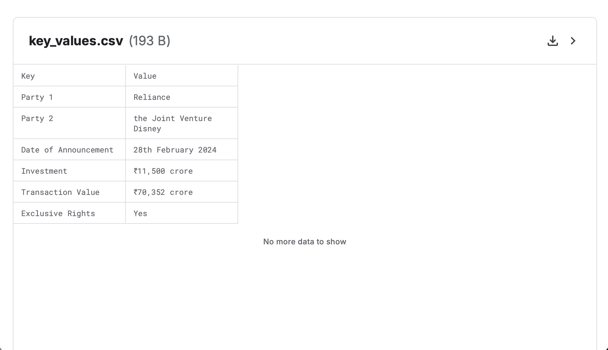

# AI DocParser

**AI DocParser** is an AI-powered document parsing tool designed to extract, process, and analyze data from various document formats. It leverages state-of-the-art machine learning models to **automate** the processing of structured and unstructured data.

## Example

### Input:

### Output:

## Features

- **Document Parsing**: Extract data from PDFs, images, and other document types.
- **AI-Powered Analysis**: Use machine learning models to understand and process text.
- **Customizable Workflows**: Easily adapt to different use cases by modifying parameters or integrating additional models.
- **Model Retraining**: Fine-tune the parsing model with custom datasets for improved accuracy.

## Tech Stack

- Implemented SpaCy for Named Entity Recognition, text extraction using fitz with accuracy of 99.22%
- Used RegEx for special type extractioon like date from the legal documents.
- Optimized data extraction with reinforcement learning, achieving high performance in dynamic PDFs
